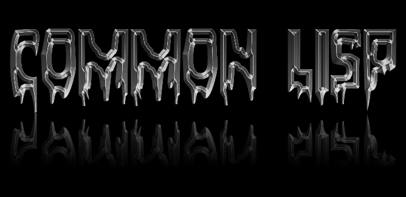

&nbsp;

# BLACK METAL COMMON LISP v0.0.1-Preview

The Grim and True VS Code Extension for the Uncompromising Common Lisp Hacker.

Currently in Preview. Expect to live on the bleeding-edge.

Also, Hail Satan.

## License

Original material:

Copyright &copy; 2020, [Black Brane Systems Inc.][blbr] Released under the MIT
License.

Common Lisp TextMate Language Bundle originally sourced from:
https://github.com/baskerville/CommonLisp.tmbundle

See [LICENSE](LICENSE) for more information.

[blbr]: https://blackbrane.com/
